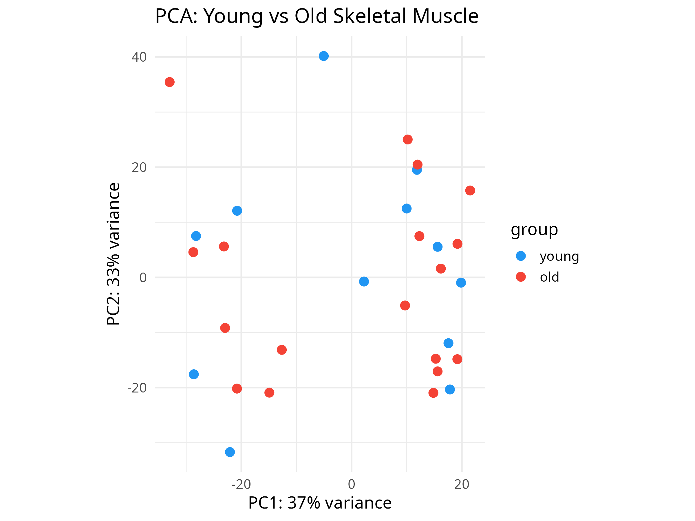
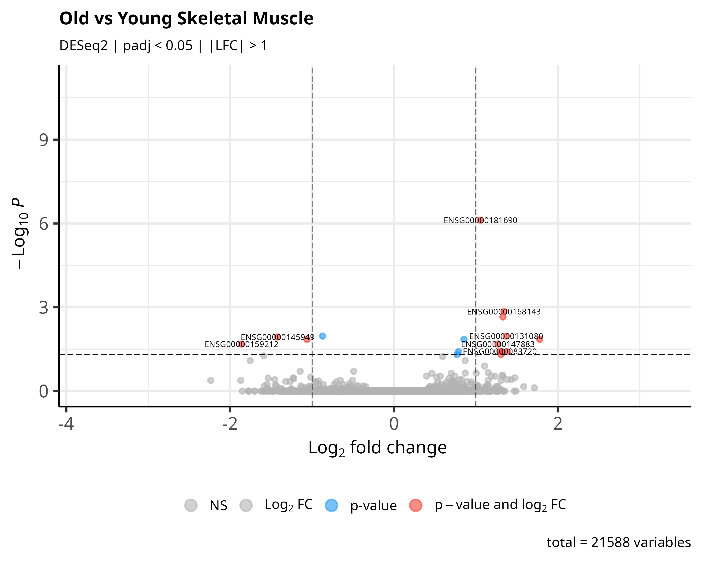
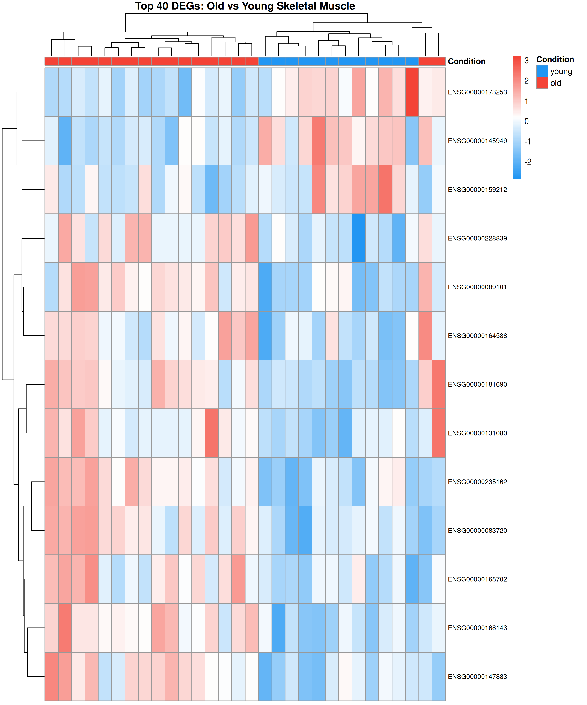
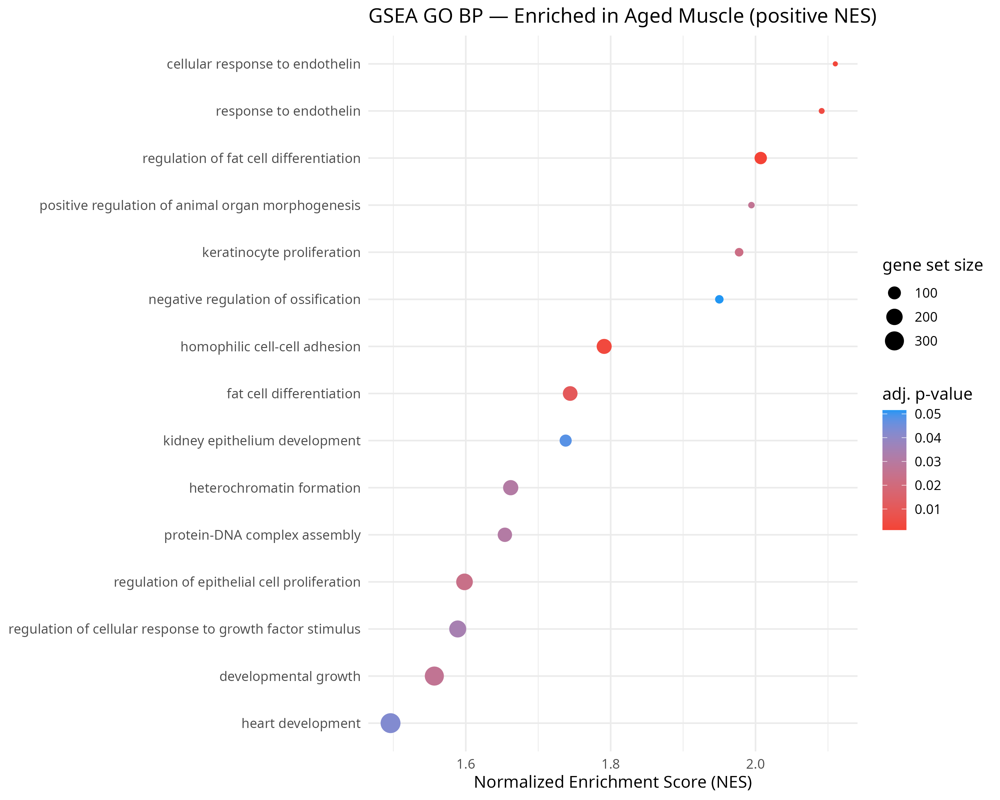
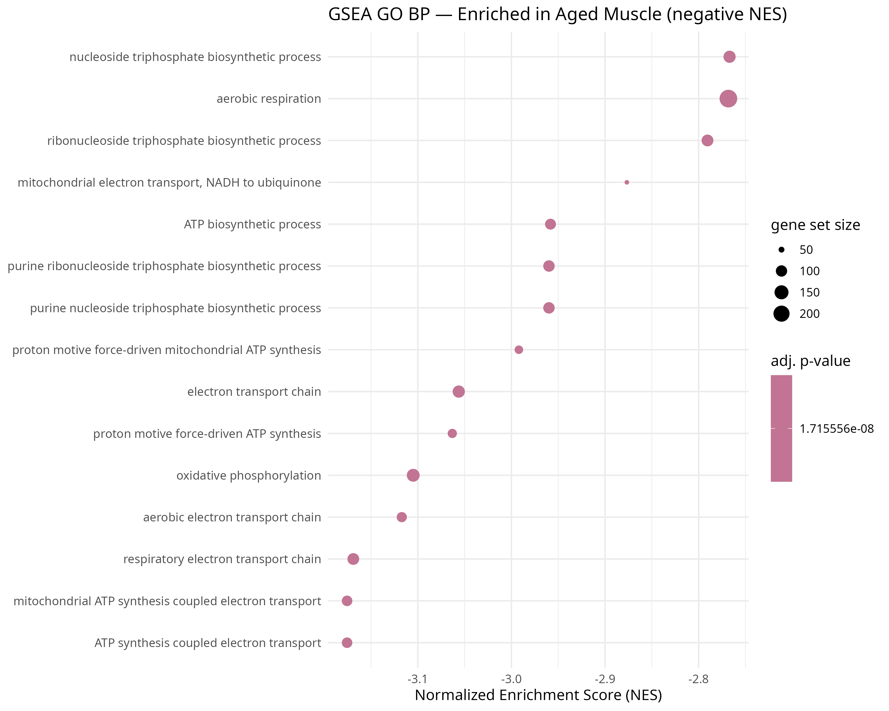

# Differential Expression Analysis: Skeletal Muscle Ageing

DESeq2-based transcriptomic analysis of human skeletal muscle 
across age groups using publicly available RNA-seq data 
(GSE164471, Tumasian et al., *Nature Communications* 2021).

## Biological Question
Which genes and pathways are differentially expressed between 
young (20–34 years) and old (65+ years) human skeletal muscle, 
and do they overlap with known ageing genes?

## Dataset
- **Source:** GEO accession GSE164471
- **Tissue:** Human skeletal muscle biopsies
- **Groups:** Young (20–34 yrs) vs Old (65–79 yrs and 80+)
- **Technology:** Total RNA-seq, Illumina HiSeq 2500

## Methods
- Quality control: DESeq2 variance stabilising transformation + PCA
- Differential expression: DESeq2 (padj < 0.05, |log2FC| > 1)
- Pathway enrichment: clusterProfiler GO Biological Process
- Ageing gene cross-reference: GenAge human database

## Key Figures

### PCA — Sample Separation by Age Group


### Volcano Plot — Differentially Expressed Genes


### Heatmap — Top 40 DEGs


### GO Enrichment — Upregulated in Aged Muscle


### GO Enrichment — Downregulated in Aged Muscle


## Results
See `results/significant_DEGs.csv` for the full list of 
significant differentially expressed genes.

## How to Reproduce
Open `deseq2-aging-analysis.Rmd` in RStudio and click Knit.

**Required R packages:**
- DESeq2, clusterProfiler, org.Hs.eg.db, EnhancedVolcano
- tidyverse, pheatmap, rmarkdown

Install with:
\```r
BiocManager::install(c("DESeq2", "clusterProfiler", 
                       "org.Hs.eg.db", "EnhancedVolcano"))
install.packages(c("tidyverse", "pheatmap"))
\```

## Reference
Tumasian RA 3rd, Harish A, Kundu G, Yang JH et al. 
Skeletal muscle transcriptome in healthy aging. 
*Nat Commun* 2021 Apr 1;12(1):2014. PMID: 33795677
